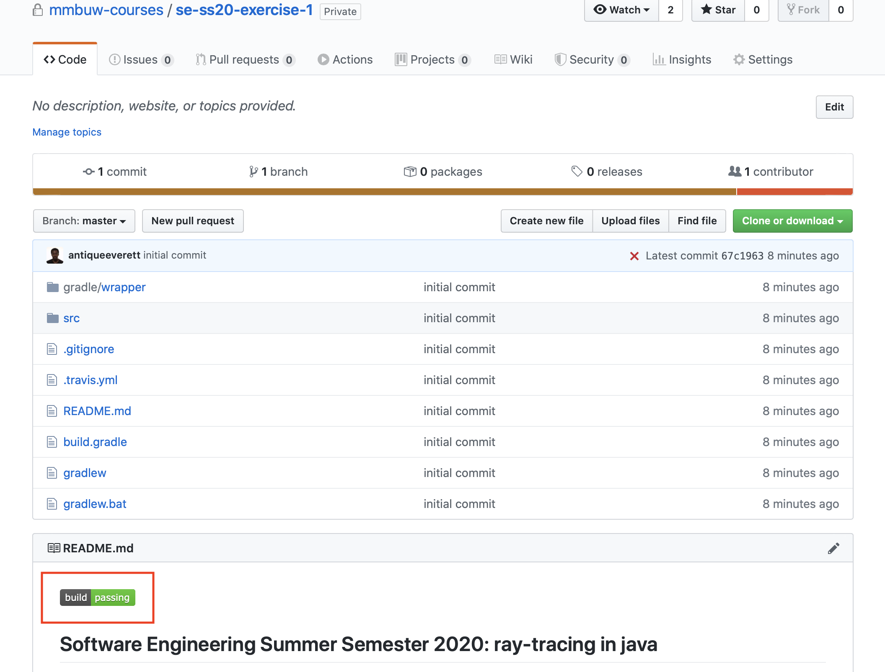
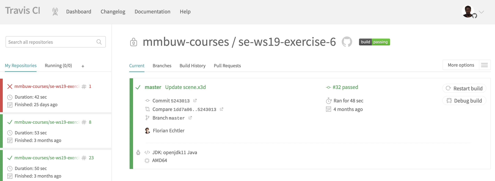
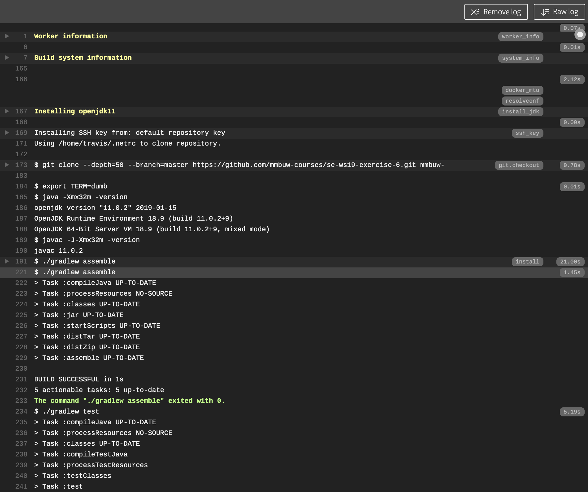

[](https://travis-ci.com/mmbuw-courses/se-ss20-exercise-1)

## Software Engineering Summer Semester 2020: ray-tracing in java  

`n.b.` 

The commands provided as part of this instructional readme need to
be run using a terminal within the repository root directory.

- [x] [ *Nix terminal ](https://en.wikipedia.org/wiki/Unix_shell) (macOS, Linux distributions, etc.) 
- [x] [ Git Bash ](https://gitforwindows.org) terminal (for Windows)
#

Clone the repository using:
```
git clone git@github.com:mmbuw-courses/se-sose20-raytracer-2.git 
```

* [ Getting started: ](#start) <br/>
&nbsp;&nbsp;&nbsp;&nbsp; → [ dependencies ](#dep) <br/>
&nbsp;&nbsp;&nbsp;&nbsp; → [ running ](#run) <br/>
&nbsp;&nbsp;&nbsp;&nbsp; → [ testing ](#run) <br/>
&nbsp;&nbsp;&nbsp;&nbsp; → [ generating an evaluation report ](#run) <br/>

* [ Continuous integration: ](#ci) <br/>
&nbsp;&nbsp;&nbsp;&nbsp; → [ working with Travis ](#travis) <br/>
&nbsp;&nbsp;&nbsp;&nbsp; → [ cumulative raytracer distribution and running updates ](#updates) <br/>
&nbsp;&nbsp;&nbsp;&nbsp; → [ raytracer scores and issues ](#scores) <br/>

* [ Exercise resources ](#res) <br/>

<a name="start"></a>
## Getting started
This ray tracing raytracer is a practical approach to learning and practicing foundational java language aspects.

Each coding raytracer is designed for [ Test Driven Development ](https://en.wikipedia.org/wiki/Test-driven_development) ([ TDD ](https://en.wikipedia.org/wiki/Test-driven_development)).


As such, each raytracer is scored based on ***PASSING TESTS***.

Each raytracer comes with starter code, i.e., an raytracer repository with minimal code and 
***FAILING TEST CASES***. The goal here is complete the raytracer using the test cases, ensuring full functionality.

The tests cases are open to improvement, iff there is no mutation of the intended test behaviour. 
However as a general note, we recommend using the test cases as they are without introducing any modifications.


Please note, throughout the completion and submission of theses exercises, 
any academic dishonesty and breach of ethics will incur penalty.

[Plagiarism](https://en.wikipedia.org/wiki/Plagiarism#cite_note-RandomHouse95-1) is the representation of another 
author's language, thoughts, ideas, or expressions as one's own. 

<a name="dep"></a>
### Dependencies
[JDK11](https://jdk.java.net/11/)

[Gradle](https://gradle.org/install/)

Any higher JDK version will work just we all!

<a name="run"></a>
### Running, Testing, and generating Evaluation Reports
*To run the application, use:*
```
gradle run
```
*To test the application using the test suite, use:*
```
gradle test
``` 
*To generate a self evaluation report, use: (feature in dev)*
```
gradle score
```

`Tip:` 
```
gradle build  # for efficient local run + test cycles
```

<a name="who"></a>
## Continuous integration
Continuous Integration or [CI](https://codeship.com/continuous-integration-essentials)
is a development practice where developers integrate code into a shared repository frequently, 
preferably several times a day. 
CI does not get rid of bugs, but however,
it does make them dramatically easier to find and remove!

As the main goal is to build a simple ray tracer using successive exercises, 
it is **imperative** to always have a solution for the previous raytracer.
For this reason, 
each new raytracer will be presented with a sample solution for the previous raytracer.

Simply put;

Exercise 1 (no sample solution needed)

Exercise 2 (presented with Exercise 1 sample solution)

Exercise 3 (presented with Exercise 1 & 2 sample solutions)

Exercise 4 (presented with Exercise 1 & 2 & 3 sample solutions)

... *and so on*

Please note, it is not mandatory to use the sample solutions, in fact, its is highly recommended and encouraged to use your own solutions!
 
<a name="travis"></a>
### Working with Travis
We will use the Travis CI for building and testing on Github 

The [build status](https://travis-ci.com/mmbuw-courses/se-ws19-exercise-6.svg?token=vuni5zSQUmyYTd2SHV6a&branch=master) 
badge (highlighted in red below) provides a visual indication of the current build, and whether or not it is currently passing.

`n.b.` 

checking the build status here is an unnecessary formality iff local tests have been run and found to pass successfully.



If the build is failing, click on the badge to get a detailed report of why the current build fails.





<a name="updates"></a>
### Updating the Exercise Repository
The raytracer starter code may be updated after it has been released ( i.e., for bug fixes, clarification, comments, hints, etc.). 

In this particular case, it is necessary to merge the latest starter code update to ensure you have the current raytracer starter code, 

To do this, simply add the raytracer repository as a remote:

```
git remote add upstream https://github.com/mmbuw-courses/se-ws19-raytracer-$NUMBER.git
```
Where $NUMBER corresponds to the Exercise number. E.g., 

for Exercise 1: 
```
git remote add upstream git@github.com:mmbuw-courses/se-sose20-raytracer-1.git
```
for Exercise 2: 
```
git remote add upstream git@github.com:mmbuw-courses/se-sose20-raytracer-2.git
```
**P.S., this need only be done once per raytracer repository!**

Once done, update

```
git pull upstream master
```
Resolving merge conflicts is inevitable and this is the perfect opportunity to get accustomed to developing an approach to merging.


<a name="res"></a>
## Exercise Resources
All raytracer resources are available in the `./res directory`.
